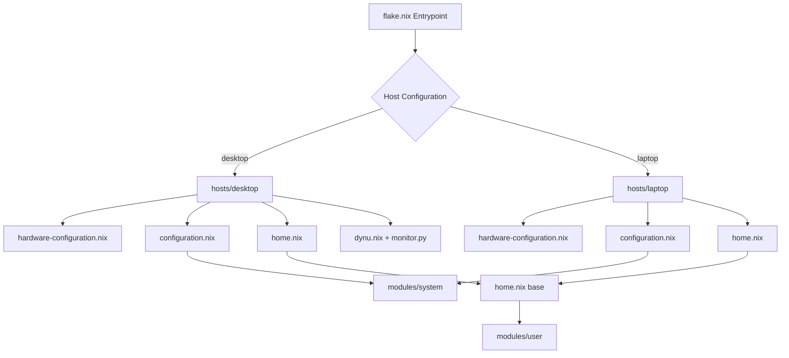
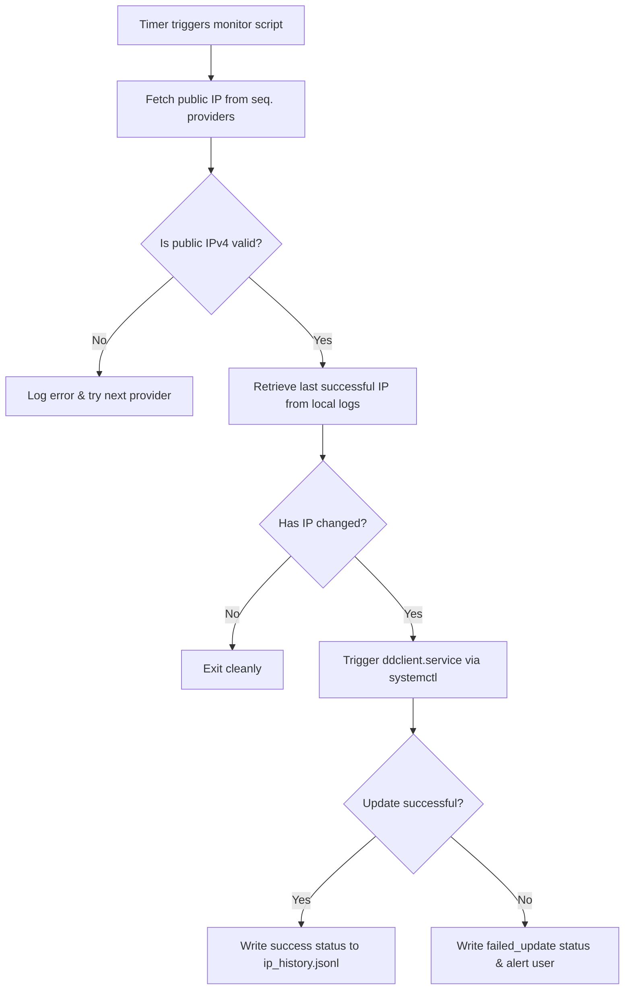
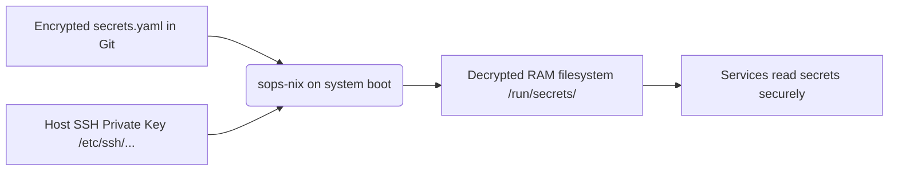

# ❄️ Declarative NixOS Workstation Configuration

This repository houses a purely declarative, reproducible NixOS configuration using Nix Flakes and Home Manager. It serves as the single source of truth for provisioning and managing high-performance Wayland-native workstation environments across desktop and laptop profiles.

---

## 🏗️ Repository Architecture

This configuration maintains a strict separation between global system defaults, shared user configuration modules, and host-specific profiles to avoid redundancy.



### Directory Structure

*   [flake.nix](flake.nix) — Main entry point defining dependencies (inputs) and system host targets.
*   [home.nix](home.nix) — Global Home Manager declaration defining the user context (`kiskaadee`).
*   [hosts/](hosts/) — Specific hardware configuration files and profiles.
    *   [hosts/desktop/](hosts/desktop/) — Configuration for the main workstation:
        *   [configuration.nix](hosts/desktop/configuration.nix) — Main desktop NixOS config.
        *   [dynu.nix](hosts/desktop/dynu.nix) — Service settings triggering Dynu DNS.
        *   [monitor.py](hosts/desktop/monitor.py) — Python script checking for public WAN IP rotations.
        *   [secrets.yaml](hosts/desktop/secrets.yaml) — Encrypted host credentials.
    *   [hosts/laptop/](hosts/laptop/) — Configuration for the mobile workstation:
        *   [configuration.nix](hosts/laptop/configuration.nix) — Main laptop NixOS config.
        *   [home.nix](hosts/laptop/home.nix) — Niri-based workspace environment settings.
*   [modules/](modules/) — Reusable, modular system and user configuration files:
    *   [modules/system/](modules/system/) — Global hardware settings, Docker, greetd, and audio:
        *   [base.nix](modules/system/base.nix) — System-wide terminal base.
        *   [graphical.nix](modules/system/graphical.nix) — System display and desktop styling modules.
    *   [modules/user/](modules/user/) — User environment settings:
        *   [base.nix](modules/user/base.nix) — Core CLI utilities, alias definitions, and fastfetch.
        *   [apps.nix](modules/user/apps.nix) — Packages including Zen Browser, Neovim, and Cloud SDKs.
        *   [terminal.nix](modules/user/terminal.nix) — Alacritty terminal emulator, Tmux configurations, and Starship.
        *   [shell/](modules/user/shell/) — Modular, domain-specific shell scripts natively compiled into the shell configuration:
            *   [git.sh](modules/user/shell/git.sh) — Automation helpers for Git staging, committing, and repositories.
            *   [jump.sh](modules/user/shell/jump.sh) — Interactive navigation helper scripts powered by `fzf` and `yazi`.
            *   [pdf.sh](modules/user/shell/pdf.sh) — Quick decryption of password-protected PDF files.
            *   [quicklinks.sh](modules/user/shell/quicklinks.sh) — Quick menu launcher for saved bookmarks and workflows.
            *   [wayland.sh](modules/user/shell/wayland.sh) — Utility to automatically pipe program stdout/stderr to the Wayland clipboard.

---

## 🛠️ Specialized Shell & Script Automation

### 1. Smart Dynamic DNS Monitor
The [monitor.py](hosts/desktop/monitor.py) daemon prevents redundant DNS updates by running a local-first check before contacting the provider API:



*   **Script Location:** [hosts/desktop/monitor.py](hosts/desktop/monitor.py)
*   **Systemd Integration:** Managed via [hosts/desktop/dynu.nix](hosts/desktop/dynu.nix) which triggers the monitor service every 30 minutes.

### 2. GPU-Accelerated Video Recording (`record.sh`)
*   **Script Location:** [hosts/desktop/config/hypr/scripts/record.sh](hosts/desktop/config/hypr/scripts/record.sh)
*   **Functionality:** Uses `wf-recorder` to record Wayland outputs.
*   **Modes:**
    *   `area` — Manually drag and draw a target bounding box using `slurp`.
    *   `window` — Target coordinates dynamically parsed from `hyprctl activewindow`.
    *   `output` — Matches coordinates of the currently active focused monitor.
    *   `screen` — Default full layout grab.
    *   `audio` flag — Parses `wpctl` to dynamically resolve output system loopback paths from PipeWire/WirePlumber to include sound.

### 3. Git Automation Shorthand (`git.sh`)
*   **Script Location:** [modules/user/shell/git.sh](modules/user/shell/git.sh)
*   **Features:**
    *   `gitignore <pattern>` — Appends pattern to project-root `.gitignore`, commits the change, and pushes to remote.
    *   `gacp <message>` — Shorthand to stage all edits, commit with a message, and push directly to the current branch.
    *   `new-repo <name>` — Scaffolds local files, runs git init, and pushes the project to GitHub using the `gh` CLI.

---

## 🔒 Secrets Management (SOPS + age)

No plain text passwords, tokens, or private keys are committed to the public history. Secrets are stored inside encrypted `.yaml` assets decrypted dynamically on-demand at boot time using **`sops-nix`** and SSH host keys.



### Adding and Modifying Secrets
1. Decrypt and open the host secrets file:
   ```bash
   nix-shell -p sops --run "sops hosts/desktop/secrets.yaml"
   ```
2. Save changes and exit. `sops` will automatically re-encrypt the file with the public keys defined in the root [.sops.yaml](.sops.yaml) configuration file.

For detailed steps on bootstrapping, key generation, and service decryption, see the [Secrets Management Guide](docs/secrets-management.md).

---

## 🚀 Quick Start / Deployment

### 1. Installation
Clone the configuration workspace directly into your home folder:
```bash
git clone https://github.com/kiskaadee/nixos-config.git ~/Config
cd ~/Config
```

### 2. Deploy System Configurations
Rebuild and switch to the profile matching your active target host machine:

*   **Desktop Workstation:**
    ```bash
    sudo nixos-rebuild switch --flake ~/Config#desktop
    ```
*   **Laptop Workstation:**
    ```bash
    sudo nixos-rebuild switch --flake ~/Config#laptop
    ```

*Note: The user environment configures `nix-switch` as an alias to automatically build and switch using the current hostname.*

---

## 📚 Reference Documentation

*   [Secrets Management Details](docs/secrets-management.md) — Secure storage configuration using `sops-nix` and `age`.
*   [Smart DDNS Updater](docs/dynu-ip-monitor.md) — Under-the-hood details of the smart IP change detector and updater.
*   [Tmux Terminal Multiplexer](docs/tmux.md) — Fast navigation bindings, layouts, and pane splits guide.
*   [Google Antigravity Setup](docs/antigravity.md) — Technical instructions for packaging and using the Antigravity agent CLI on NixOS.
