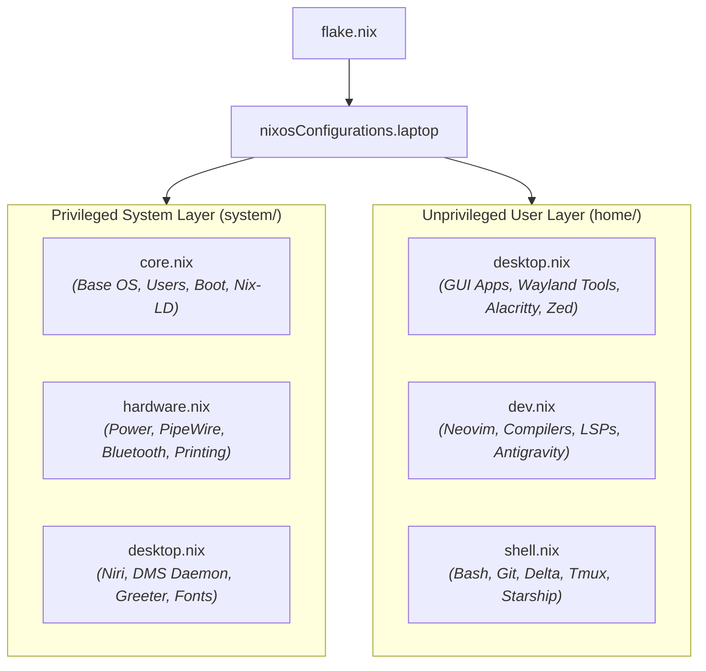

# ❄️ Declarative NixOS Laptop Workstation Configuration

This repository houses a purely declarative, reproducible NixOS configuration using Nix Flakes and Home Manager. It serves as the single source of truth for provisioning and managing a high-performance, Wayland-native mobile workstation environment on laptop powered by the Niri scrollable window manager and DankMaterialShell.

Homelab infrastructure and server services are maintained independently in the [Core](file:///home/kiskaadee/Projects/active/homelab/Core) repository.

---

## 🏗️ Repository Architecture

The repository enforces a clear separation between privileged system declarations (`system/`) and unprivileged user-space dotfiles and toolchains (`home/`), organized by functional domains.


```mermaid
graph TD
    A["flake.nix"] --> B["nixosConfigurations.laptop"]

    subgraph System ["Privileged System Layer (system/)"]
        S_CORE["core.nix<br/><i>(Base OS, Users, Boot, Nix-LD)</i>"]
        S_HW["hardware.nix<br/><i>(Power, PipeWire, Bluetooth, Printing)</i>"]
        S_DESK["desktop.nix<br/><i>(Niri, DMS Daemon, Greeter, Fonts)</i>"]
    end

    subgraph User ["Unprivileged User Layer (home/)"]
        U_DESK["desktop.nix<br/><i>(GUI Apps, Wayland Tools, Alacritty, Zed)</i>"]
        U_DEV["dev.nix<br/><i>(Neovim, Compilers, LSPs, Antigravity)</i>"]
        U_SH["shell.nix<br/><i>(Bash, Git, Delta, Tmux, Starship)</i>"]
    end

    B --> System
    B --> User
```

### Directory Structure

*   [flake.nix](flake.nix) — Main entry point defining dependencies (inputs) and system host target (`laptop`).
*   [system/](system/) — Privileged NixOS system-level configuration modules:
    *   [default.nix](system/default.nix) — System composition entrypoint.
    *   [hardware-configuration.nix](system/hardware-configuration.nix) — Generated hardware scan (disks, CPU microcode, kernel modules).
    *   [core.nix](system/core.nix) — Base operating system, bootloader, networking, user account, and `nix-ld`.
    *   [hardware.nix](system/hardware.nix) — Power management (`power-profiles-daemon`, `upower`), audio (`pipewire`), printing/scanning, and Docker.
    *   [desktop.nix](system/desktop.nix) — Niri compositor enablement, DankMaterialShell daemon, greetd login, and fonts.
*   [home/](home/) — Home Manager user-space configuration modules (`kiskaadee`):
    *   [default.nix](home/default.nix) — User environment entrypoint, state version, and session search paths.
    *   [desktop.nix](home/desktop.nix) — Graphical applications (Zen Browser, Zed, media), Wayland capture tools, Alacritty, and Niri/Zed dotfiles.
    *   [dev.nix](home/dev.nix) — Neovim editor setup, developer toolchains (Rust, Python, Node, LSPs), Antigravity CLI, and dev utilities.
    *   [shell.nix](home/shell.nix) — Interactive Bash shell, Git/Delta configuration, SSH client profiles, Tmux, Starship, and Fastfetch.
    *   [config/](home/config/) — Static dotfile source trees (Alacritty, Fastfetch, Niri, Neovim, Zed, Starship, Tmux).
    *   [scripts/](home/scripts/) — Compiled standalone user scripts (`bundle_project.py`, `record.sh`).
    *   [shell/](home/shell/) — Modular Bash helper scripts sourced into `.bashrc`.
*   [docs/](docs/) — Maintenance runbooks and operational workflows.

---

## 🛠️ Specialized Shell & Script Automation

### 1. GPU-Accelerated Video Recording (`record`)
*   **Script Location:** [home/scripts/record.sh](home/scripts/record.sh)
*   **Functionality:** Uses `wf-recorder` to record Wayland outputs in Niri sessions.
*   **Modes:**
    *   `area` — Manually drag and draw a target bounding box using `slurp`.
    *   `window` — Target active window or interactively select via `slurp`.
    *   `output` — Matches coordinates of the currently active focused monitor (`niri msg`).
    *   `screen` — Full layout capture.
    *   `audio` flag — Parses `wpctl` to dynamically resolve output system loopback paths from PipeWire/WirePlumber to include sound.

### 2. Git Automation Shorthand (`git.sh`)
*   **Script Location:** [home/shell/git.sh](home/shell/git.sh)
*   **Features:**
    *   `gitignore <pattern>` — Appends pattern to project-root `.gitignore`, commits the change, and pushes to remote.
    *   `gacp <message>` — Shorthand to stage all edits, commit with a message, and push directly to the current branch.
    *   `new-repo <name>` — Scaffolds local files, runs git init, and pushes the project to GitHub using the `gh` CLI.

### 3. Todo.txt & Tuxedo Productivity Helper (`todo.sh`)
*   **Script Location:** [home/shell/todo.sh](home/shell/todo.sh)
*   **Features:**
    *   `todo` — Launches the interactive `tuxedo` TUI for the local `./todo.txt`.
    *   `todo n` / `todo next` — Displays only the highest-priority focus task.
    *   `todo n <N>` / `todo next <N>` — Displays the top `N` priority tasks (e.g. `todo n 3`).
    *   `todo dn` / `todo do-next` — Auto-completes the top priority task.
    *   `_todo_color` — Built-in awk parser adding ANSI color formatting for priorities, `@contexts`, `+projects`, dates, and `key:value` tags without broken-pipe errors.

### 4. Repository Bundler Utility (`bundle-project`)
*   **Script Location:** [home/scripts/bundle_project.py](home/scripts/bundle_project.py)
*   **Features:**
    *   `bundle-project [target_dir] [-o output_file]` — Compresses the structure and contents of a target directory (defaults to `.`) into a single output file (defaults to `output.txt`).
    *   Natively skips binary files and `.git` repositories to prevent pollution.
    *   Automatically runs `eza --tree` and outputs it as a visual guide at the header of the bundle file.

---

## 🔒 Secrets Management (SOPS + age)

Sensitive credentials (tokens, private keys) are managed using `sops` and `age`. Plaintext secrets are never committed to version control.

For bootstrapping, key generation, and decryption workflows, consult the [Secrets Management Guide](docs/secrets.md).

---

## 🚀 Quick Start / Deployment

### 1. Installation & Bare-Metal Recovery
For fresh machine setup and disaster recovery, follow the [Getting Started: Fresh Installation & Recovery Runbook](docs/getting-started.md).

```bash
git clone https://github.com/kiskaadee/nixos-config.git ~/Config
cd ~/Config
```

### 2. Validate & Test Build
Verify flake evaluation and dry-build the derivation without switching:
```bash
nix flake check
nix build .#nixosConfigurations.laptop.config.system.build.toplevel --no-link
```

### 3. Apply Configuration
Switch to the new generation on the laptop:
```bash
sudo nixos-rebuild switch --flake ~/Config#laptop
```
*Tip: The shell environment includes the `nix-switch` alias to automatically rebuild using the local hostname.*

---

## 📚 Workstation Operations Manual

*   [Getting Started: Fresh Installation & Recovery](docs/getting-started.md) — Bare-metal install, reference partitioning, hardware config, and desktop bootstrap.
*   [Adding Software](docs/adding-software.md) — Decision tree for package placement, `home.packages` vs `programs.foo`, and unfree packages.
*   [Configuration Workflow](docs/configuration.md) — Day-to-day editing, dry-build validation, testing, and dotfiles management.
*   [System Lifecycle & Rebuilds](docs/system-lifecycle.md) — Nix rebuild pipeline, generations, bootloader rollback, and garbage collection.
*   [Desktop Environment (Niri + DMS)](docs/desktop.md) — Compositor stack, declarative vs runtime state boundary, and master shortcut reference.
*   [Secrets Management & Homelab GitOps](docs/secrets.md) — Operator authoring tooling on laptop vs runtime decryption on Core.
*   [Networking & Remote Access](docs/networking.md) — NetworkManager, OpenSSH client profiles, and LAN remote access.

### Reference Manuals
*   [Interactive Shell Environment](docs/reference/shell.md) — Bash configuration, Starship prompt, and modular shell scripts.
*   [Tmux Terminal Multiplexer](docs/reference/tmux.md) — Session workflows, layouts, and navigation keybindings.
*   [Neovim Editor Architecture](docs/reference/neovim.md) — Neovim Lua configuration, LSPs, treesitter, and formatting.
*   [Antigravity AI Agent Setup](docs/reference/antigravity.md) — Constitution, change protocols, and tooling integration.
