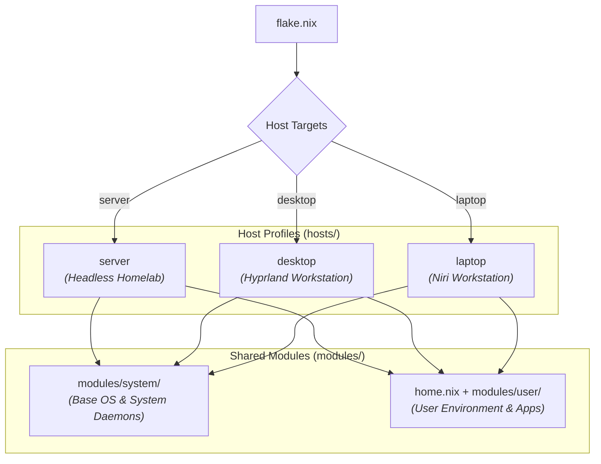
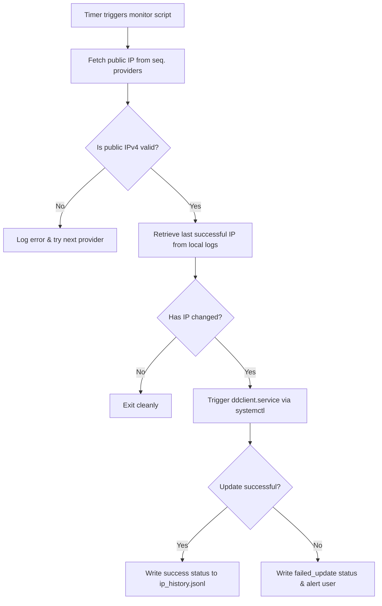
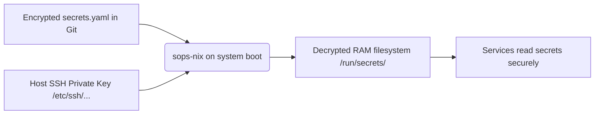

# ❄️ Declarative NixOS Workstation Configuration

This repository houses a purely declarative, reproducible NixOS configuration using Nix Flakes and Home Manager. It serves as the single source of truth for provisioning and managing high-performance Wayland-native workstation environments across desktop and laptop profiles.

---

## 🏗️ Repository Architecture

This configuration maintains a strict separation between global system defaults, shared user configuration modules, and host-specific profiles to avoid redundancy.


```mermaid
graph TD
    A["flake.nix"] --> B{"Host Targets"}

    subgraph Hosts ["Host Profiles (hosts/)"]
        S["server<br/><i>(Headless Homelab)</i>"]
        D["desktop<br/><i>(Hyprland Workstation)</i>"]
        L["laptop<br/><i>(Niri Workstation)</i>"]
    end

    B -->|"server"| S
    B -->|"desktop"| D
    B -->|"laptop"| L

    subgraph Shared ["Shared Modules (modules/)"]
        SYS["modules/system/<br/><i>(Base OS & System Daemons)</i>"]
        USER["home.nix + modules/user/<br/><i>(User Environment & Apps)</i>"]
    end

    S --> SYS
    D --> SYS
    L --> SYS

    S --> USER
    D --> USER
    L --> USER
```

### Directory Structure

*   [flake.nix](flake.nix) — Main entry point defining dependencies (inputs) and system host targets (`server`, `desktop`, `laptop`).
*   [home.nix](home.nix) — Global Home Manager declaration defining the user context (`kiskaadee`).
*   [hosts/](hosts/) — Specific hardware configuration files and profiles.
    *   [hosts/server/](hosts/server/) — Dedicated headless homelab server configuration:
        *   [configuration.nix](hosts/server/configuration.nix) — Headless server NixOS config (power-tuned, no GUI, no greeter).
        *   [home.nix](hosts/server/home.nix) — Pure CLI user environment with server diagnostic tools (`htop`, `iotop`, `ncdu`).
        *   [dynu.nix](hosts/server/dynu.nix) — Service settings triggering Dynu DDNS.
        *   [homeserver.nix](hosts/server/homeserver.nix) — Core services declarative systemd service.
        *   [traefik-deployments.nix](hosts/server/traefik-deployments.nix) — Edge proxy secrets and microservice templates.
        *   [monitor.py](hosts/server/monitor.py) — Python script checking for public WAN IP rotations.
        *   [secrets.yaml](hosts/server/secrets.yaml) — Encrypted server credentials.
    *   [hosts/desktop/](hosts/desktop/) — Legacy dual-mode workstation configuration:
        *   [configuration.nix](hosts/desktop/configuration.nix) — Main desktop NixOS config with specialisation.
        *   [home.nix](hosts/desktop/home.nix) — Hyprland desktop environment settings.
    *   [hosts/laptop/](hosts/laptop/) — Configuration for the mobile workstation:
        *   [configuration.nix](hosts/laptop/configuration.nix) — Main laptop NixOS config.
        *   [home.nix](hosts/laptop/home.nix) — Niri-based workspace environment settings.
*   [modules/](modules/) — Reusable, modular system and user configuration files:
    *   [modules/system/](modules/system/) — Global hardware settings, Docker, greetd, and audio:
        *   [base.nix](modules/system/base.nix) — System-wide terminal base.
        *   [graphical.nix](modules/system/graphical.nix) — System display and desktop styling modules.
    *   [modules/user/](modules/user/) — User environment settings:
        *   [base.nix](modules/user/base.nix) — Core CLI utilities, alias definitions, and fastfetch.
        *   [apps.nix](modules/user/apps.nix) — Packages including Zen Browser, Neovim, and Cloud SDKs.
        *   [terminal.nix](modules/user/terminal.nix) — Alacritty terminal emulator, Tmux configurations, and Starship.
        *   [shell/](modules/user/shell/) — Modular, domain-specific shell scripts natively compiled into the shell configuration:
            *   [git.sh](modules/user/shell/git.sh) — Automation helpers for Git staging, committing, and repositories.
            *   [jump.sh](modules/user/shell/jump.sh) — Interactive navigation helper scripts powered by `fzf` and `yazi`.
            *   [pdf.sh](modules/user/shell/pdf.sh) — Quick decryption of password-protected PDF files.
            *   [quicklinks.sh](modules/user/shell/quicklinks.sh) — Quick menu launcher for saved bookmarks and workflows.
            *   [todo.sh](modules/user/shell/todo.sh) — Productivity shortcuts and syntax highlighter for `todo.txt` and `tuxedo`.
            *   [wayland.sh](modules/user/shell/wayland.sh) — Utility to automatically pipe program stdout/stderr to the Wayland clipboard.

---

## 🛠️ Specialized Shell & Script Automation

### 1. Smart Dynamic DNS Monitor
The [monitor.py](hosts/desktop/monitor.py) daemon prevents redundant DNS updates by running a local-first check before contacting the provider API:


```mermaid
flowchart TD
    A[Timer triggers monitor script] --> B[Fetch public IP from seq. providers]
    B --> C{Is public IPv4 valid?}
    C -->|No| D[Log error & try next provider]
    C -->|Yes| E[Retrieve last successful IP from local logs]
    E --> F{Has IP changed?}
    F -->|No| G[Exit cleanly]
    F -->|Yes| H[Trigger ddclient.service via systemctl]
    H --> I{Update successful?}
    I -->|Yes| J[Write success status to ip_history.jsonl]
    I -->|No| K[Write failed_update status & alert user]
```

*   **Script Location:** [hosts/desktop/monitor.py](hosts/desktop/monitor.py)
*   **Systemd Integration:** Managed via [hosts/desktop/dynu.nix](hosts/desktop/dynu.nix) which triggers the monitor service every 30 minutes.

### 2. GPU-Accelerated Video Recording (`record`)
*   **Script Location:** [modules/user/scripts/record.sh](modules/user/scripts/record.sh)
*   **Functionality:** Uses `wf-recorder` to record Wayland outputs across both Niri and Hyprland sessions.
*   **Modes:**
    *   `area` — Manually drag and draw a target bounding box using `slurp`.
    *   `window` — Target active window or interactively select via `slurp`.
    *   `output` — Matches coordinates of the currently active focused monitor (`niri msg` / `hyprctl`).
    *   `screen` — Full layout capture.
    *   `audio` flag — Parses `wpctl` to dynamically resolve output system loopback paths from PipeWire/WirePlumber to include sound.

### 3. Git Automation Shorthand (`git.sh`)
*   **Script Location:** [modules/user/shell/git.sh](modules/user/shell/git.sh)
*   **Features:**
    *   `gitignore <pattern>` — Appends pattern to project-root `.gitignore`, commits the change, and pushes to remote.
    *   `gacp <message>` — Shorthand to stage all edits, commit with a message, and push directly to the current branch.
    *   `new-repo <name>` — Scaffolds local files, runs git init, and pushes the project to GitHub using the `gh` CLI.

### 4. Todo.txt & Tuxedo Productivity Helper (`todo.sh`)
*   **Script Location:** [modules/user/shell/todo.sh](modules/user/shell/todo.sh)
*   **Features:**
    *   `todo` — Launches the interactive `tuxedo` TUI for the local `./todo.txt`.
    *   `todo n` / `todo next` — Displays only the highest-priority focus task.
    *   `todo n <N>` / `todo next <N>` — Displays the top `N` priority tasks (e.g. `todo n 3`).
    *   `todo dn` / `todo do-next` — Auto-completes the top priority task.
    *   `_todo_color` — Built-in awk parser adding ANSI color formatting for priorities, `@contexts`, `+projects`, dates, and `key:value` tags without broken-pipe errors.

### 5. Repository Bundler Utility (`bundle-project`)
*   **Script Location:** [modules/user/scripts/bundle_project.py](modules/user/scripts/bundle_project.py)
*   **Features:**
    *   `bundle-project [target_dir] [-o output_file]` — Compresses the structure and contents of a target directory (defaults to `.`) into a single output file (defaults to `output.txt`).
    *   Natively skips binary files and `.git` repositories to prevent pollution.
    *   Automatically runs `eza --tree` and outputs it as a visual guide at the header of the bundle file.

---

## 🔒 Secrets Management (SOPS + age)

No plain text passwords, tokens, or private keys are committed to the public history. Secrets are stored inside encrypted `.yaml` assets decrypted dynamically on-demand at boot time using **`sops-nix`** and SSH host keys.


```mermaid
graph LR
    A[Encrypted secrets.yaml in Git] --> B(sops-nix on system boot)
    C[Host SSH Private Key /etc/ssh/...] --> B
    B --> D[Decrypted RAM filesystem /run/secrets/]
    D --> E[Services read secrets securely]
```

### Adding and Modifying Secrets
1. Decrypt and open the host secrets file:
   ```bash
   nix-shell -p sops --run "sops hosts/desktop/secrets.yaml"
   ```
2. Save changes and exit. `sops` will automatically re-encrypt the file with the public keys defined in the root [.sops.yaml](.sops.yaml) configuration file.

For detailed steps on bootstrapping, key generation, and service decryption, see the [Secrets Management Guide](docs/secrets-management.md).

---

## 🚀 Quick Start / Deployment

### 1. Installation
Clone the configuration workspace directly into your home folder:
```bash
git clone https://github.com/kiskaadee/nixos-config.git ~/Config
cd ~/Config
```

### 2. Deploy System Configurations
Rebuild and switch to the profile matching your active target host machine:

*   **Desktop Workstation:**
    ```bash
    sudo nixos-rebuild switch --flake ~/Config#desktop
    ```
*   **Laptop Workstation:**
    ```bash
    sudo nixos-rebuild switch --flake ~/Config#laptop
    ```

*Note: The user environment configures `nix-switch` as an alias to automatically build and switch using the current hostname.*

---

## 📚 Reference Documentation

*   [Package & Secrets Workflow Guide](docs/package-and-secrets.md) — Steps for adding custom applications and managing secrets.
*   [System Maintenance Guide](docs/system-maintenance.md) — Instructions for safe system updates, health checking, and garbage collection.
*   [Declarative Development Environments](docs/development-environments.md) — How to use nix-shell, devShells, direnv, and uv for project isolation.
*   [Secrets Management Details](docs/secrets-management.md) — Secure storage bootstrapping using `sops-nix` and `age`.
*   [Smart DDNS Updater](docs/dynu-ip-monitor.md) — Under-the-hood details of the smart IP change detector and updater.
*   [Tmux Terminal Multiplexer](docs/tmux.md) — Fast navigation bindings, layouts, and pane splits guide.
*   [Google Antigravity Setup](docs/antigravity.md) — Technical instructions for packaging and using the Antigravity agent CLI on NixOS.

