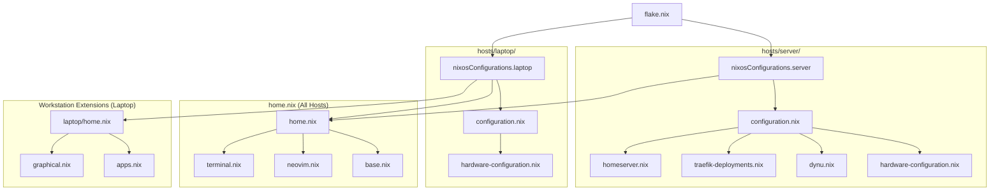

# System Architecture

## Core Principles

This repository manages a declarative NixOS configuration for multiple host targets (`server`, `laptop`) and shared user environments via Home Manager.

1. **Git is the Source of Truth**: Every persistent system configuration must be declaratively defined within this repository.
2. **Runtime State Separation**: Runtime state (Docker volumes, dynamic IP caches, `/run/secrets/`, mutable state) must not become configuration state.
3. **Layered Isolation**: System modules provide reusable machine infrastructure; user modules configure user environments; host directories bind hardware, secrets, and machine-specific services together.

---

## Topology & Directory Structure

```text
Config/
├── flake.nix                  # Flake inputs and nixosConfigurations public entrypoint
├── flake.lock                 # Pinned dependencies
├── home.nix                   # Root Home Manager shared entrypoint (Pure CLI: base, neovim, terminal)
├── .sops.yaml                 # SOPS encryption keys and path rules
│
├── hosts/                     # Machine-specific configurations
│   ├── server/
│   │   ├── configuration.nix  # Server NixOS configuration (headless homelab node)
│   │   ├── hardware-configuration.nix # Generated hardware configuration
│   │   ├── home.nix           # Server-specific Home Manager profile (diagnostics CLI)
│   │   ├── secrets.yaml       # Encrypted server secrets (SOPS)
│   │   ├── dynu.nix           # Dynu DDNS update service
│   │   ├── homeserver.nix     # Core homelab runtime services (Docker)
│   │   └── traefik-deployments.nix # Traefik edge reverse proxy
│   │
│   └── laptop/
│       ├── configuration.nix  # Laptop NixOS configuration (Niri compositor)
│       ├── hardware-configuration.nix # Generated hardware configuration
│       ├── home.nix           # Laptop-specific Home Manager profile (Niri dotfiles)
│       └── secrets.yaml       # Encrypted laptop secrets (SOPS)
│
├── modules/
│   ├── system/                # Reusable system-level NixOS modules (shared across hosts)
│   │   ├── base.nix           # Core OS settings, networking, audio, docker, bluetooth
│   │   └── graphical.nix      # Shared display manager (greetd / DMS) & graphical daemons
│   │
│   └── user/                  # Reusable Home Manager modules (tiered split)
│       ├── base.nix           # Tier 1: Pure CLI shell, utilities, Git, common environment
│       ├── terminal.nix       # Tier 1: Pure CLI multiplexer (tmux) & prompt (starship)
│       ├── neovim.nix         # Tier 1: Modular Neovim editor configuration
│       ├── apps.nix           # Tier 2: Developer & user applications (Tea, Antigravity, SDKs)
│       ├── graphical.nix      # Tier 3: Graphical user tools, Alacritty, Wayland stack, LSPs
│       ├── shell/             # Modular shell scripts, aliases, and functions
│       ├── scripts/           # Standalone helper scripts
│       └── config/            # Managed application dotfiles
│
└── docs/                      # Procedural and operational documentation
```

---

## Layer Responsibilities



### 1. `flake.nix`
- **Role**: Public entry point for package set pinning, external flake inputs, and host output wiring (`nixosConfigurations`).
- **Contains**: `inputs` definitions (`nixpkgs`, `home-manager`, `dms`, `sops-nix`, `antigravity`, etc.) and system module composition via `specialArgs`.
- **Must Not Contain**: Package lists, user configurations, shell scripts, or host-specific options.

### 2. `hosts/<host>/`
- **Role**: Contains everything specific to an individual physical machine.
- **Includes**:
  - `hardware-configuration.nix`: Generated hardware and kernel parameters (managed by `nixos-generate-config`).
  - `configuration.nix`: Hostname, bootloader, host-specific users, GPU/display drivers, and specialisations.
  - `home.nix`: User packages and dotfiles tied to the host's desktop environment or headless role.
  - `secrets.yaml`: SOPS-encrypted secrets for that machine.
  - Host infrastructure services (e.g., `homeserver.nix`, `dynu.nix`, `traefik-deployments.nix` on `server`).

### 3. `modules/system/`
- **Role**: Reusable system configuration shared by multiple hosts.
- **Rule**: A module must only be placed here when its assumptions are valid for every host importing it. If a configuration is meaningful only for one host, keep it under `hosts/<host>/`.

### 4. `modules/user/`
- **Role**: Reusable Home Manager modules organized into clean, predictable layers:
  - **Tier 1: Pure CLI Base** (`base.nix`, `terminal.nix`, `neovim.nix` via `home.nix`): Imported on all hosts (headless server, laptop). Provides pure terminal tools (`tmux`, `starship`), editor, Git, and essential CLI diagnostics.
  - **Tier 2: Developer & User Apps** (`apps.nix`): Imported by workstation profiles. Provides developer toolchains, cloud SDKs, Git forge clients (`tea`, `gh`), and media tools.
  - **Tier 3: Graphical Desktop Environment** (`graphical.nix`): Imported by workstation profiles. Provides Alacritty, Firefox, Zen Browser, Zed, DankSearch, Wayland capture/clipboard utilities (`wl-clipboard`, `grim`, `slurp`, `swappy`, `wf-recorder`, `obs-studio`), and Language Servers.
  - `shell/`, `scripts/`, `config/`: Shell utility files and structured dotfiles.

---

## Placement Guide: Where Things Belong

| Concern | Target Location | Placement Rule |
| :--- | :--- | :--- |
| **External Dependencies** | `flake.nix` | Flake inputs only; lock `inputs.nixpkgs.follows` where applicable. |
| **Shared System Services** | `modules/system/` | Systemd services, system packages, or OS features valid for all importing hosts. |
| **Host System Settings** | `hosts/<host>/configuration.nix` | Hostname, bootloader, user groups, machine-specific daemons. |
| **Hardware / Disks** | `hosts/<host>/hardware-configuration.nix` | Generated configuration. Do not manually restructure or refactor. |
| **Shared CLI Foundations** | `modules/user/base.nix`, `terminal.nix` | Tier 1 pure CLI tools (Git, tmux, starship, core utilities) shared across all hosts. |
| **Workstation Dev Tools** | `modules/user/apps.nix` | Tier 2 developer CLI & cloud tools (`tea`, `antigravity`, compilers, SDKs). |
| **Workstation Graphical Stack** | `modules/user/graphical.nix` | Tier 3 GUI applications, terminal emulator (`alacritty`), Wayland tools, LSPs. |
| **Host-Specific User Apps** | `hosts/<host>/home.nix` | Tools relevant only to that host (e.g., Niri utilities on laptop). |
| **Shared Shell Tools** | `modules/user/shell/` | Modular bash/zsh helpers, aliases, and functions. |
| **Standalone Scripts** | `modules/user/scripts/` | Executable user shell scripts. |
| **Application Dotfiles** | `modules/user/config/` | Managed static configuration files linked into `$HOME/.config/`. |
| **Encrypted Secrets** | `hosts/<host>/secrets.yaml` | Encrypted with SOPS/age; referenced via `config.sops.secrets.*.path`. |
| **Homelab Services / DDNS** | `hosts/server/` | Machine-specific homelab infrastructure, reverse proxy, and DDNS monitor. |
| **How-To Guides** | `docs/` | Operational procedures and maintenance workflows. |

---

## Architectural Invariants

These rules define the repository boundaries and must not be violated:

1. **Flake Public Entrypoint Invariant**: `flake.nix` is the sole public entrypoint for building the repository's NixOS host configurations.
2. **Package Ownership Invariant**: Shared user applications belong under `modules/user/` categorized by tier (`base.nix` / `terminal.nix` for pure CLI, `apps.nix` for developer tools, `graphical.nix` for GUI/Wayland). Do not introduce arbitrary package lists in `modules/system/` unless strictly required for system-wide root maintenance or core OS services.
3. **Host Isolation Invariant**: Machine-specific homelab infrastructure (`homeserver.nix`, `traefik-deployments.nix`, `dynu.nix`) must remain isolated under their respective host directories and must never be imported into `hosts/laptop/`.
4. **Secrets Security Invariant**: Secrets must stay encrypted in Git via SOPS. Plaintext secrets must never be committed. Configurations must refer to secrets at runtime via `/run/secrets/` or `config.sops.secrets.<name>.path`. Never decrypt secrets into tracked or persistent working-tree files. Never add, modify, or rotate SOPS/age keys unless explicitly requested.
5. **Hardware Configuration Invariant**: `hardware-configuration.nix` is generated configuration. Do not manually restructure, clean up, or refactor it. Hardware-specific changes should normally be produced by `nixos-generate-config`; deliberate manual additions require explicit justification.
6. **Consumer Validation Invariant**: Changes to shared modules (`modules/system/` or `modules/user/`) or composed host configurations must be evaluated against all downstream consumers in the import graph (`server` and `laptop`).
7. **State Compatibility Invariant**: `system.stateVersion` and `home.stateVersion` (`26.05`) are compatibility declarations for stateful data and must not be bumped casually as part of routine maintenance or package updates.
