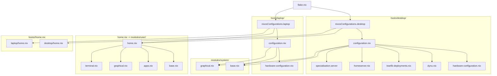

# System Architecture

## Core Principles

This repository manages a declarative NixOS configuration for multiple host targets (`desktop`, `laptop`) and shared user environments via Home Manager.

1. **Git is the Source of Truth**: Every persistent system configuration must be declaratively defined within this repository.
2. **Runtime State Separation**: Runtime state (Docker volumes, dynamic IP caches, `/run/secrets/`, mutable state) must not become configuration state.
3. **Layered Isolation**: System modules provide reusable machine infrastructure; user modules configure user environments; host directories bind hardware, secrets, and machine-specific services together.

---

## Topology & Directory Structure

```text
Config/
├── flake.nix                  # Flake inputs and nixosConfigurations public entrypoint
├── flake.lock                 # Pinned dependencies
├── home.nix                   # Root Home Manager shared entrypoint
├── .sops.yaml                 # SOPS encryption keys and path rules
│
├── hosts/                     # Machine-specific configurations
│   ├── desktop/
│   │   ├── configuration.nix  # Desktop NixOS configuration & server specialization
│   │   ├── hardware-configuration.nix # Generated hardware configuration
│   │   ├── home.nix           # Desktop-specific Home Manager profile (Hyprland dotfiles)
│   │   ├── secrets.yaml       # Encrypted desktop secrets (SOPS)
│   │   ├── dynu.nix           # Dynu DDNS update service
│   │   ├── homeserver.nix     # Core homelab runtime services
│   │   └── traefik-deployments.nix # Traefik edge reverse proxy
│   │
│   └── laptop/
│       ├── configuration.nix  # Laptop NixOS configuration (Niri compositor)
│       ├── hardware-configuration.nix # Generated hardware configuration
│       ├── home.nix           # Laptop-specific Home Manager profile
│       └── secrets.yaml       # Encrypted laptop secrets (SOPS)
│
├── modules/
│   ├── system/                # Reusable system-level NixOS modules (shared across hosts)
│   │   ├── base.nix           # Core OS settings, networking, audio, docker, bluetooth
│   │   └── graphical.nix      # Shared display manager (greetd / DMS) & graphical daemons
│   │
│   └── user/                  # Reusable Home Manager modules (shared across hosts)
│       ├── base.nix           # Core shell, utilities, Git, common environment
│       ├── apps.nix           # Centralized user applications & CLI tools
│       ├── graphical.nix      # Graphical user tools & Neovim configuration
│       ├── terminal.nix       # Terminal emulators (Alacritty), multiplexers (Tmux), prompt
│       ├── shell/             # Modular shell scripts, aliases, and functions
│       ├── scripts/           # Standalone helper scripts
│       └── config/            # Managed application dotfiles
│
└── docs/                      # Procedural and operational documentation
```

---

## Layer Responsibilities



### 1. `flake.nix`
- **Role**: Public entry point for package set pinning, external flake inputs, and host output wiring (`nixosConfigurations`).
- **Contains**: `inputs` definitions (`nixpkgs`, `home-manager`, `dms`, `sops-nix`, `antigravity`, etc.) and system module composition via `specialArgs`.
- **Must Not Contain**: Package lists, user configurations, shell scripts, or host-specific options.

### 2. `hosts/<host>/`
- **Role**: Contains everything specific to an individual physical machine.
- **Includes**:
  - `hardware-configuration.nix`: Generated hardware and kernel parameters (managed by `nixos-generate-config`).
  - `configuration.nix`: Hostname, bootloader, host-specific users, GPU/display drivers, and specialisations.
  - `home.nix`: User packages and dotfiles tied to the host's desktop environment.
  - `secrets.yaml`: SOPS-encrypted secrets for that machine.
  - Host infrastructure services (e.g., `homeserver.nix`, `dynu.nix`, `traefik-deployments.nix` on `desktop`).

### 3. `modules/system/`
- **Role**: Reusable system configuration shared by multiple hosts.
- **Rule**: A module must only be placed here when its assumptions are valid for every host importing it. If a configuration is meaningful only for one host, keep it under `hosts/<host>/`.

### 4. `modules/user/`
- **Role**: Reusable Home Manager modules managing user packages, shell environments, and dotfiles.
- **Subcomponents**:
  - Shared user applications belong under `modules/user/`. `apps.nix` is the current central application module.
  - `base.nix`: Git, shell baseline, session variables.
  - `graphical.nix`: User-level graphical tools and modular Neovim configuration.
  - `terminal.nix`: Multiplexers (`tmux`), terminal emulators (`alacritty`), prompt (`starship`).
  - `shell/`, `scripts/`, `config/`: Shell utility files and structured dotfiles.

---

## Placement Guide: Where Things Belong

| Concern | Target Location | Placement Rule |
| :--- | :--- | :--- |
| **External Dependencies** | `flake.nix` | Flake inputs only; lock `inputs.nixpkgs.follows` where applicable. |
| **Shared System Services** | `modules/system/` | Systemd services, system packages, or OS features valid for all importing hosts. |
| **Host System Settings** | `hosts/<host>/configuration.nix` | Hostname, bootloader, user groups, machine-specific daemons. |
| **Hardware / Disks** | `hosts/<host>/hardware-configuration.nix` | Generated configuration. Do not manually restructure or refactor. |
| **Shared User Apps** | `modules/user/` (`apps.nix`) | Default location for CLI and GUI user software common across hosts. |
| **Host-Specific User Apps** | `hosts/<host>/home.nix` | Tools relevant only to that host (e.g., Hyprland screen recorders on desktop). |
| **Shared Shell Tools** | `modules/user/shell/` | Modular bash/zsh helpers, aliases, and functions. |
| **Standalone Scripts** | `modules/user/scripts/` | Executable user shell scripts. |
| **Application Dotfiles** | `modules/user/config/` | Managed static configuration files linked into `$HOME/.config/`. |
| **Encrypted Secrets** | `hosts/<host>/secrets.yaml` | Encrypted with SOPS/age; referenced via `config.sops.secrets.*.path`. |
| **Desktop Homelab / DDNS** | `hosts/desktop/` | Desktop-specific homelab infrastructure, reverse proxy, and DDNS monitor. |
| **How-To Guides** | `docs/` | Operational procedures and maintenance workflows. |

---

## Architectural Invariants

These rules define the repository boundaries and must not be violated:

1. **Flake Public Entrypoint Invariant**: `flake.nix` is the sole public entrypoint for building the repository's NixOS host configurations.
2. **Package Ownership Invariant**: Shared user applications belong under `modules/user/` (with `apps.nix` as the central application module). Do not introduce arbitrary package lists in `modules/system/` unless they are strictly required for system-wide root maintenance or core OS services.
3. **Host Isolation Invariant**: Desktop-specific homelab infrastructure (`homeserver.nix`, `traefik-deployments.nix`, `dynu.nix`) must remain isolated under `hosts/desktop/` and must never be imported into `hosts/laptop/`.
4. **Desktop Server Specialisation Invariant**: `hosts/desktop/configuration.nix` defines `specialisation.server.configuration`. The server specialization must remain valid, bootable, and strictly headless (disabling display managers, PipeWire, Bluetooth, and desktop sleep targets).
5. **Secrets Security Invariant**: Secrets must stay encrypted in Git via SOPS. Plaintext secrets must never be committed. Configurations must refer to secrets at runtime via `/run/secrets/` or `config.sops.secrets.<name>.path`. Never decrypt secrets into tracked or persistent working-tree files. Never add, modify, or rotate SOPS/age keys unless explicitly requested.
6. **Hardware Configuration Invariant**: `hardware-configuration.nix` is generated configuration. Do not manually restructure, clean up, or refactor it. Hardware-specific changes should normally be produced by `nixos-generate-config`; deliberate manual additions require explicit justification.
7. **Consumer Validation Invariant**: Changes to shared modules (`modules/system/` or `modules/user/`) or composed host configurations must be evaluated against all downstream consumers in the import graph (`desktop` and `laptop`).
8. **State Compatibility Invariant**: `system.stateVersion` and `home.stateVersion` (`26.05`) are compatibility declarations for stateful data and must not be bumped casually as part of routine maintenance or package updates.
