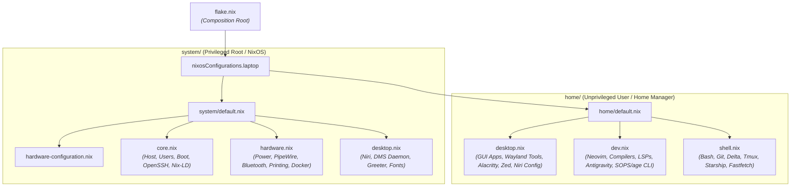

# System Architecture: Standalone Workstation

## Core Principles

This repository manages a purely declarative NixOS and Home Manager configuration for a standalone mobile workstation host (`laptop`).

1. **Declarative System State vs. Mutable Runtime State**: Reproducibility in this repository means **reproducible declared system state**, not necessarily byte-for-byte reproducible runtime/user state. The workstation is **declaratively reproducible, with an explicitly documented desktop bootstrap state**. Dynamic runtime state (SSH host private keys, machine-id, DMS runtime settings and monitor layouts, browser profiles, caches, and Docker volumes) lives outside the declarative boundary. A runtime-mutated file must never be converted into a Home Manager-managed file merely because it is important or because tracking it in Git would appear to improve reproducibility.
2. **Domain-Driven Cohesion**: Configuration is organized by functional domain (`core`, `hardware`, `desktop`, `dev`, `shell`) rather than artificial multi-machine abstractions.
3. **Privilege Boundary Separation**:
   - **`system/` (Root/NixOS)**: Governs hardware, kernel, bootloader, base OS daemons, and system-level compositor enablement.
   - **`home/` (User/Home Manager)**: Governs user dotfiles, application settings, toolchains, and desktop keybindings inside `/home/kiskaadee`.
4. **Decoupled Homelab Infrastructure**: Production server daemons, Docker stacks, Traefik edge routing, and DDNS automation are maintained independently in the [Core](file:///home/kiskaadee/Projects/active/homelab/Core) repository.
5. **Workstation Remote Access ≠ Server Infrastructure**: Local system daemons (such as the OpenSSH server) are legitimate workstation facilities for LAN access, remote editor attachments, and file transfers. They do not constitute "server infrastructure," which refers to independently operated application workloads and edge proxies.

---

## Topology & Directory Structure

```text
Config/
├── flake.nix                   # Flake inputs and composition root for nixosConfigurations.laptop
├── flake.lock                  # Pinned dependency revisions
│
├── system/                     # NixOS system-level configuration (root / privileged)
│   ├── default.nix             # System composition entrypoint
│   ├── hardware-configuration.nix # Generated hardware scan (disks, CPU, kernel modules)
│   ├── core.nix                # Base OS: networking, users, locale, openssh, nix-ld
│   ├── hardware.nix            # Machine services & peripherals: power, PipeWire, bluetooth, printing, docker
│   └── desktop.nix             # Desktop stack: Niri compositor, DMS daemon, greetd, fonts
│
├── home/                       # Home Manager user-level configuration (kiskaadee)
│   ├── default.nix             # User session entrypoint (paths, state version)
│   ├── desktop.nix             # Graphical apps (Zen, Zed, media), Wayland tools, DankSearch, Niri/Zed dotfiles
│   ├── dev.nix                 # Developer toolchains (Rust, Python, Node, LSPs), Antigravity, Neovim, SOPS/age CLI
│   ├── shell.nix               # Interactive shell (Bash, aliases, modular scripts), Git, Delta, Tmux, Starship
│   ├── config/                 # Managed application dotfiles (alacritty, niri, nvim, zed, fastfetch, tmux)
│   ├── scripts/                # Standalone helper scripts (bundle-project, record)
│   └── shell/                  # Modular bash source scripts (git, jump, pdf, quicklinks, todo, wayland)
│
└── docs/                       # Operational workflows and maintenance runbooks
```

---

## Layer Responsibilities & Composition Roots

The repository utilizes a dual-composition model anchored by `flake.nix`:



### 1. `flake.nix`
- **Role**: Sole public composition root declaring external flake inputs (`nixpkgs`, `home-manager`, `dms`, `zen-browser`, `antigravity`, etc.) and wiring `system/` and `home/` into the `laptop` target.
- **Rule**: Contains only inputs and host output definitions. No inline packages, scripts, or machine-specific options.

### 2. `system/` (Machine Privileged Layer)
- **Role**: Contains all machine-level declarations requiring root privileges.
- **Components**:
  - `hardware-configuration.nix`: Generated hardware parameters (managed by `nixos-generate-config`).
  - `core.nix`: Bootloader (`systemd-boot`), network identity, time zone, locale, main user account (`kiskaadee`), dynamic binary support (`nix-ld`), and workstation remote access (`openssh`).
  - `hardware.nix`: Machine services & peripherals (`power-profiles-daemon`, `upower`, `brightnessctl`), PipeWire audio, Bluetooth, printing/scanning drivers, and Docker runtime.
  - `desktop.nix`: Niri window manager enablement, DMS background daemon & greeter, greetd login manager, typography/fonts, and Wayland session environment variables.

### 3. `home/` (User-Space Interactive Layer)
- **Role**: Contains all user-space declarations and dotfiles managed by Home Manager.
- **Components**:
  - `default.nix`: Root user environment declaration (username, home directory, state version, session search paths).
  - `desktop.nix`: Graphical productivity tools, Wayland screen capture/clipboard utilities, Alacritty terminal emulator, Firefox profile, DankSearch indexer, and declarative symlinks for Niri (`config.kdl`, `custom.kdl`) and Zed (`settings.json`, themes).
  - `dev.nix`: Neovim editor configuration (Lua init, Tree-sitter, LSP plugins, DAP), toolchains (Rust, Python, Node), language servers, API testing tools, Antigravity CLI, and operator secrets tooling (`sops`, `age`, `rbw`).
  - `shell.nix`: Bash shell aliases, prompt (`starship`), multiplexer (`tmux`), Git/Delta configuration, SSH client profiles, and modular shell helpers.

---

## Placement Guide: Where Things Belong

| Concern | Target Location | Placement Rule |
| :--- | :--- | :--- |
| **External Dependencies** | `flake.nix` | Flake inputs only; lock `inputs.nixpkgs.follows` where applicable. |
| **Kernel / Disks / Firmware** | `system/hardware-configuration.nix` | Generated hardware scan. Do not manually restructure. |
| **Root OS / User Groups / Boot** | `system/core.nix` | Bootloader, users, host name, locale, nix-ld, workstation SSH daemon. |
| **Machine Services & Peripherals**| `system/hardware.nix` | Audio, power profiles, battery, bluetooth, printing, docker. |
| **System Compositor & Greeter** | `system/desktop.nix` | Niri enablement, greetd, DMS shell daemon, system fonts. |
| **GUI Apps & Wayland Utilities** | `home/desktop.nix` | Browser, Zed, Alacritty, clipboard, screen capture tools. |
| **Compilers, LSPs & Editors** | `home/dev.nix` | Neovim, toolchains, language servers, developer utilities. |
| **Shell, Aliases & Multiplexer** | `home/shell.nix` | Bash, Tmux, Starship, Fastfetch, Git, Direnv, SSH client config. |
| **Static Application Dotfiles** | `home/config/` | Application configs linked into `$HOME/.config/`. |
| **Standalone Scripts** | `home/scripts/` | Executable user utility scripts. |
| **Modular Shell Helpers** | `home/shell/` | Discrete `.sh` files sourced by `.bashrc`. |
| **Operator Secrets Tooling** | `home/dev.nix` | `sops`, `age`, and `rbw` CLI tools for authoring Core homelab secrets. |
| **Homelab Services & Secrets** | `~/Projects/active/homelab/Core` | Managed independently in the Core repository. |

---

## Architectural Invariants

1. **Single Entrypoint Invariant**: `flake.nix` is the sole entrypoint for building the workstation system (`laptop`). Neither `system/` nor `home/` are deployed independently.
2. **Context-Driven Package Ownership**:
   - Packages in `system/` are reserved for tools required by NixOS modules, system services, hardware integration, login/session infrastructure, or privileged administration.
   - Packages in `home/` are dedicated to the user's interactive environment, developer toolchains, and desktop applications.
3. **Decoupled Homelab Invariant**: Server infrastructure, Traefik edge proxying, and Docker container stacks belong exclusively in the `Core` repository and must never be merged back into this workstation configuration.
4. **Hardware Configuration Invariant**: `system/hardware-configuration.nix` is generated by `nixos-generate-config`. Do not manually alter hardware disk UUIDs or module lists without explicit verification.
5. **State Compatibility Invariant**: `system.stateVersion` and `home.stateVersion` (`26.05`) are compatibility declarations for stateful data and must not be bumped casually.
