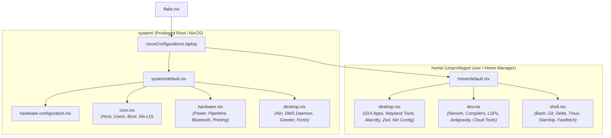

# System Architecture: Standalone Workstation

## Core Principles

This repository manages a purely declarative NixOS and Home Manager configuration for a standalone mobile workstation host (`laptop`).

1. **Git is the Source of Truth**: Every persistent system setting, user dotfile, and toolchain declaration must be declaratively defined within this repository.
2. **Domain-Driven Cohesion**: Configuration is organized by functional domain (`core`, `hardware`, `desktop`, `dev`, `shell`) rather than artificial host tiers or defensive multi-machine boundaries.
3. **Privilege Boundary Separation**:
   - **`system/` (Root/NixOS)**: Governs hardware, kernel, bootloader, base OS daemons, and system-level compositor enablement.
   - **`home/` (User/Home Manager)**: Governs user dotfiles, application settings, toolchains, and desktop keybindings inside `/home/kiskaadee`.
4. **Decoupled Homelab Infrastructure**: Production server daemons, Docker stacks, Traefik edge routing, and DDNS automation are maintained independently in the [Core](file:///home/kiskaadee/Projects/active/homelab/Core) repository.

---

## Topology & Directory Structure

```text
Config/
├── flake.nix                   # Flake inputs and nixosConfigurations.laptop entrypoint
├── flake.lock                  # Pinned dependency revisions
│
├── system/                     # NixOS system-level configuration (root / privileged)
│   ├── default.nix             # System composition entrypoint
│   ├── hardware-configuration.nix # Generated hardware scan (disks, CPU, kernel modules)
│   ├── core.nix                # Base OS: networking, users, locale, openssh, nix-ld
│   ├── hardware.nix            # Laptop hardware: power daemon, upower, PipeWire, bluetooth, printing, docker
│   └── desktop.nix             # Desktop stack: Niri compositor, DMS, greetd, fonts
│
├── home/                       # Home Manager user-level configuration (kiskaadee)
│   ├── default.nix             # User session entrypoint (paths, state version)
│   ├── desktop.nix             # Graphical apps (Zen, Zed, media), Wayland tools, DankSearch, Niri/Zed dotfiles
│   ├── dev.nix                 # Developer toolchains (Rust, Python, Node, LSPs), Antigravity, Neovim
│   ├── shell.nix               # Interactive shell (Bash, aliases, modular scripts), Git, Delta, Tmux, Starship
│   ├── config/                 # Managed application dotfiles (alacritty, niri, nvim, zed, fastfetch, tmux)
│   ├── scripts/                # Standalone helper scripts (bundle-project, record)
│   └── shell/                  # Modular bash source scripts (git, jump, pdf, quicklinks, todo, wayland)
│
└── docs/                       # Operational workflows and maintenance runbooks
```

---

## Layer Responsibilities



### 1. `flake.nix`
- **Role**: Public entry point declaring external flake inputs (`nixpkgs`, `home-manager`, `dms`, `zen-browser`, `antigravity`, etc.) and composing the single `laptop` target.
- **Rule**: Contains only inputs and host output definitions. No package lists or host-specific options.

### 2. `system/`
- **Role**: Contains all system-level declarations requiring root privileges.
- **Components**:
  - `hardware-configuration.nix`: Generated hardware parameters (managed by `nixos-generate-config`).
  - `core.nix`: Bootloader (`systemd-boot`), network identity, time zone, locale, main user account (`kiskaadee`), unfree license acceptance, and `nix-ld` dynamic library loader.
  - `hardware.nix`: Power & battery management (`power-profiles-daemon`, `upower`, `brightnessctl`), PipeWire audio, Bluetooth, printing/scanning drivers, and Docker runtime.
  - `desktop.nix`: Niri window manager enablement, DMS background daemon & greeter, greetd login manager, typography/fonts, and Wayland session environment variables.

### 3. `home/`
- **Role**: Contains all user-space declarations and dotfiles managed by Home Manager.
- **Components**:
  - `default.nix`: Root user environment declaration (username, home directory, state version, session paths).
  - `desktop.nix`: Graphical productivity tools, Wayland screen capture/clipboard utilities, Alacritty terminal emulator, Firefox profile, DankSearch indexer, and declarative symlinks for Niri (`config.kdl`, `custom.kdl`) and Zed (`settings.json`, themes).
  - `dev.nix`: Neovim editor configuration (Lua init, Tree-sitter, LSP plugins, DAP), toolchains (Rust, Python, Node), language servers, API testing tools (`httpie`, `bruno`), and Antigravity CLI.
  - `shell.nix`: Bash shell aliases, prompt (`starship`), multiplexer (`tmux`), Git/Delta configuration, SSH client profiles, and modular shell helpers.

---

## Placement Guide: Where Things Belong

| Concern | Target Location | Placement Rule |
| :--- | :--- | :--- |
| **External Dependencies** | `flake.nix` | Flake inputs only; lock `inputs.nixpkgs.follows` where applicable. |
| **Kernel / Disks / Firmware** | `system/hardware-configuration.nix` | Generated hardware scan. Do not manually restructure. |
| **Root OS / User Groups / Boot** | `system/core.nix` | Bootloader, users, host name, locale, nix-ld. |
| **Machine Hardware Services** | `system/hardware.nix` | Audio, power profiles, battery, bluetooth, printing, docker. |
| **System Compositor & Greeter** | `system/desktop.nix` | Niri enablement, greetd, DMS shell daemon, system fonts. |
| **GUI Apps & Wayland Utilities** | `home/desktop.nix` | Browser, Zed, Alacritty, clipboard, screen capture tools. |
| **Compilers, LSPs & Editors** | `home/dev.nix` | Neovim, toolchains, language servers, developer utilities. |
| **Shell, Aliases & Multiplexer** | `home/shell.nix` | Bash, Tmux, Starship, Fastfetch, Git, Direnv, SSH config. |
| **Static Application Dotfiles** | `home/config/` | Application configs linked into `$HOME/.config/`. |
| **Standalone Scripts** | `home/scripts/` | Executable user utility scripts. |
| **Modular Shell Helpers** | `home/shell/` | Discrete `.sh` files sourced by `.bashrc`. |
| **Encrypted Secrets** | SOPS / age | Decrypted dynamically into memory at runtime via SOPS. |
| **Homelab Services** | `~/Projects/active/homelab/Core` | Managed independently in the Core repository. |

---

## Architectural Invariants

1. **Single Entrypoint Invariant**: `flake.nix` is the sole entrypoint for building the workstation system (`laptop`).
2. **Domain Separation Invariant**: User packages belong in `home/` categorized by functional domain (`desktop.nix` for GUI/Wayland, `dev.nix` for developer tools, `shell.nix` for terminal productivity). System-level packages in `system/` are strictly reserved for root administration and core OS daemons.
3. **Decoupled Homelab Invariant**: Server infrastructure, Traefik edge proxying, and Docker container stacks belong in the `Core` repository and must never be merged back into this workstation configuration.
4. **Hardware Configuration Invariant**: `system/hardware-configuration.nix` is generated by `nixos-generate-config`. Do not manually alter hardware disk UUIDs or module lists without explicit verification.
5. **State Compatibility Invariant**: `system.stateVersion` and `home.stateVersion` (`26.05`) are compatibility declarations for stateful data and must not be bumped casually.
