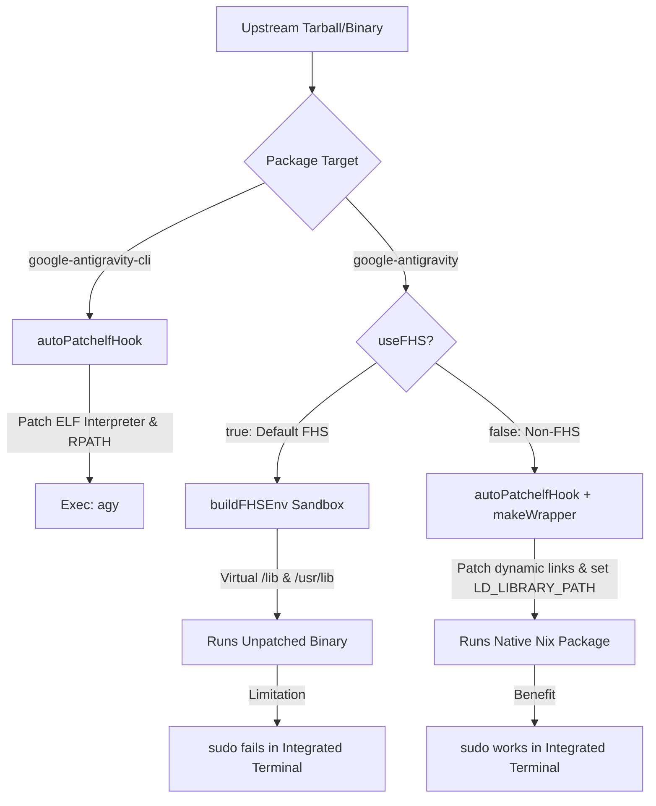

# ❄️ NixOS Installation Guide: Google Antigravity & Antigravity-v2 Apps

Google Antigravity is a next-generation agentic coding companion and IDE helper. While installation on standard Linux distributions is straightforward, NixOS's unique, purely functional model requires a different approach. Because Antigravity is distributed as a **closed-source pre-compiled binary**, running it directly on NixOS causes immediate failures due to the absence of the Filesystem Hierarchy Standard (FHS).

This guide explains the underlying problem, technical challenges, packaging strategies, and step-by-step configuration details for integrating Antigravity into a modular NixOS setup.

---

## 🛑 1. Problem Statement

On standard Linux distributions (e.g., Ubuntu, Arch), binaries rely on hardcoded paths to load dynamic linkers and shared libraries:
- Dynamic linker/interpreter path (e.g., `/lib64/ld-linux-x86-64.so.2`)
- System libraries (e.g., `/lib`, `/usr/lib`, `/usr/lib64`)

NixOS breaks away from the FHS. It features a read-only store located at `/nix/store/` where every package is isolated under a unique cryptographic hash. As a result:
1. **Dynamic Linker Failure**: The operating system will immediately refuse to run an unpatched binary because the path to the interpreter `/lib64/ld-linux-x86-64.so.2` does not exist. This results in the cryptic error:
   ```bash
   bash: ./antigravity: No such file or directory
   ```
2. **Library Resolution Failure**: Even if the dynamic linker is patched, the binary will fail at runtime when trying to locate dynamic dependencies (`.so` files) that are not present in standard system directories.

---

## ⚡ 2. The Technical Challenges

Packaging Antigravity on NixOS introduces three main challenges:

### A. Closed-Source Binary Delivery
Because Google Antigravity is proprietary, we cannot compile it from source code. Nix cannot automatically resolve compile-time configurations or inject dependency paths during a compilation phase. Instead, we must patch the pre-compiled binary directly or wrap it in a containerized environment.

### B. The FHS Sandbox vs. `sudo` Permissions
Historically, Electron applications on NixOS have been packaged using `buildFHSEnv` which sets up a virtual FHS directory layout using `bubblewrap`. 
While this is effective for running the app, it sets the kernel's **`no new privileges`** flag.
> [!WARNING]
> If you run Antigravity inside an FHS environment, the integrated terminal **will not support `sudo`**. Running any command requiring elevated privileges (like `sudo nixos-rebuild switch`) will fail immediately because of the bubblewrap restrictions.

### C. Chromium Runtime Dependency
Antigravity depends on an external browser engine (Google Chrome or Chromium) to render certain previews and dashboards. It expects standard executables like `google-chrome-stable` or `chromium` to be available in the path, and requires proper environment hooks (`CHROME_BIN` and `CHROME_PATH`) to connect to them.

### D. Hardcoded Electron Scripts
Inside the packaged Electron archive (`asar`), scripts like `@vscode/sudo-prompt` contain hardcoded paths to system executables (e.g., `/usr/bin/pkexec` or `/bin/bash`), which do not exist on NixOS.

---

## 🛠️ 3. Packaging Strategy & Implementation

The community-maintained repository `jacopone/antigravity-nix` implements a dual-mode package design. A Mermaid diagram below illustrates how dependencies and runtime paths are resolved:



### Strategy Details:

| Component / Mode | Strategy Used | Technical Implementation | Rationale |
| :--- | :--- | :--- | :--- |
| **CLI (`google-antigravity-cli`)** | Binary Patching | Uses `autoPatchelfHook` to overwrite ELF interpreter and inject dependencies into `RPATH`. Renames package binary to `agy`. | High performance, low footprint, integrates natively with any shell configuration without overhead. |
| **GUI App (`google-antigravity`)** | `buildFHSEnv` (FHS) | Creates a virtual FHS root using bubblewrap. Mounts critical system configuration mounts (`/etc/nixos`, `/etc/xdg`) and wraps standard runtime libs. | High compatibility. Guaranteed to run on all setups because the binary acts as if it is on a standard Ubuntu system. |
| **GUI App (`google-antigravity-no-fhs`)** | Native Wrapping | Patches system libraries via `autoPatchelfHook` and uses `makeWrapper` to propagate environment variables (`LD_LIBRARY_PATH`, `CHROME_BIN`). | **Recommended for developers.** Avoids sandbox privilege restrictions, allowing `sudo` commands inside the integrated terminal. |

#### Automated File Patching
To fix the hardcoded script paths within the Electron components, the flake unpacks the application archives during the build phase:
1. It extracts `resources/app/node_modules.asar` using `asar`.
2. It patches `@vscode/sudo-prompt/index.js` to redirect `/usr/bin/pkexec` -> `/run/wrappers/bin/pkexec` and `/bin/bash` -> Nix store's native `bash` interpreter.
3. It packages it back into the `.asar` file structure.

---

## 📋 4. Step-by-Step Installation Guide

Follow these steps to integrate the Antigravity package suite declaratively into your NixOS configuration using inputs and Home Manager.

### Step 1: Declare the Input in `flake.nix`

Add `antigravity-nix` to your flake inputs in `flake.nix`. Ensure that you lock its inputs to follow your system's `nixpkgs` channel for consistency:

```nix
# flake.nix
{
  description = "My NixOS Configuration";

  inputs = {
    nixpkgs.url = "github:nixos/nixpkgs/nixos-unstable";
    
    # Community Flake for Google Antigravity
    antigravity = {
      url = "github:jacopone/antigravity-nix";
      inputs.nixpkgs.follows = "nixpkgs"; # Keeps dependencies in sync
    };
  };

  outputs = { self, nixpkgs, antigravity, ... }@inputs: {
    # System outputs (e.g. nixosConfigurations.desktop)
  };
}
```

---

### Step 2: Configure System Packages or Home Manager

You can inject the packages using standard package inputs in your configurations:

#### Option A: Home Manager Integration (Recommended)
This matches your system's user setup. Add the required package to your user packages module (e.g., `modules/user/apps.nix`):

```nix
# modules/user/apps.nix
{ inputs, pkgs, ... }:

{
  home.packages = with pkgs; [
    # 1. Install the CLI tool (accessible via 'agy')
    inputs.antigravity.packages.${pkgs.stdenv.hostPlatform.system}.google-antigravity-cli

    # 2. Install the GUI application.
    # Choose google-antigravity-no-fhs to support sudo in terminal, or google-antigravity for standard FHS.
    inputs.antigravity.packages.${pkgs.stdenv.hostPlatform.system}.google-antigravity-no-fhs

    # 3. (Optional) Install the legacy IDE component
    inputs.antigravity.packages.${pkgs.stdenv.hostPlatform.system}.google-antigravity-ide-no-fhs
  ];
}
```

#### Option B: Global System Packages (`configuration.nix`)
To make the application available to all users on the host machine:

```nix
# configuration.nix
{ inputs, pkgs, ... }:

{
  environment.systemPackages = [
    # System-wide installation
    inputs.antigravity.packages.x86_64-linux.google-antigravity-cli
    inputs.antigravity.packages.x86_64-linux.google-antigravity-no-fhs
  ];
}
```

---

### Step 3: Enable Unfree Packages
Since Google Antigravity and Chrome are proprietary, NixOS will refuse to build the configuration unless unfree packages are explicitly allowed. Ensure this is configured:

```nix
# configuration.nix or base.nix
{
  nixpkgs.config.allowUnfree = true;
}
```

---

### Step 4: Rebuild and Apply
Run the rebuild switch script or alias for your machine target:

```bash
# Rebuild the system
sudo nixos-rebuild switch --flake ~/Config#desktop
```

---

## ⚡ 5. Verification & Alternate Runs

### Run Without Installing
If you want to run any of the components without modifying your configuration permanently, you can use the `nix run` command directly:

* **Launch the main CLI tool (`agy`):**
  ```bash
  nix run github:jacopone/antigravity-nix#google-antigravity-cli -- --help
  ```
* **Launch the GUI application (FHS):**
  ```bash
  nix run github:jacopone/antigravity-nix#google-antigravity
  ```
* **Launch the GUI application (Non-FHS):**
  ```bash
  nix run github:jacopone/antigravity-nix#google-antigravity-no-fhs
  ```

---

## 🔄 6. Automatic Updates

The `jacopone/antigravity-nix` repository is updated automatically approximately three times a week via GitHub Actions to track new releases of the Antigravity binary.

To update your local installation to the latest available package version:
1. Navigate to your configuration repository:
   ```bash
   cd ~/Config
   ```
2. Update the lockfile entry for the input:
   ```bash
   nix flake lock --update-input antigravity
   ```
3. Reapply your configuration:
   ```bash
   sudo nixos-rebuild switch --flake .#desktop
   ```
