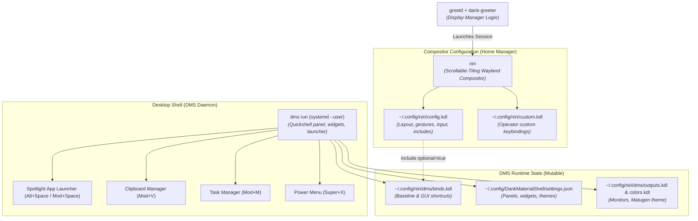

# 🎨 Desktop Environment: Niri & DankMaterialShell (DMS)

This document describes the architecture of the workstation's graphical desktop environment, the boundary between declarative configuration and runtime state, and the master shortcut reference.

---

## 1. Desktop Architecture & Components

The graphical workstation stack is built from modern Wayland components:



---

## 2. The Ownership & Mutability Boundary

A critical architectural invariant is respecting the distinction between **declarative specification** and **runtime-mutable state**:

| Layer | Files | Managed By Git? | Mutability | Rationale |
| :--- | :--- | :--- | :--- | :--- |
| **Declarative Core** | `home/config/niri/config.kdl`<br/>`home/config/niri/custom.kdl` | **Yes** | Immutable store symlinks | Governs compositor rules, gesture bindings, and personal shortcuts. |
| **System Daemon** | `system/desktop.nix` | **Yes** | Immutable NixOS module | Enables Niri, DMS package, Greetd greeter, fonts. |
| **DMS Keybindings** | `~/.config/niri/dms/binds.kdl` | **No** (Seeded) | Mutable (`0644`) | Initialized via `dms setup binds`. Editable in DMS Settings GUI. |
| **DMS UI Preferences** | `~/.config/DankMaterialShell/settings.json` | **No** | Mutable | Stores user's bar widget selections, padding, and corner radius. |
| **Display Outputs** | `~/.config/niri/dms/outputs.kdl` | **No** | Dynamic runtime | Generated by DMS when external displays are connected/repositioned. |
| **Color Schemes** | `~/.config/niri/dms/colors.kdl` | **No** | Dynamic runtime | Extracted by Matugen from the active wallpaper. |

> [!CAUTION]
> Do not attempt to manage `~/.config/niri/dms/` or `~/.config/DankMaterialShell/settings.json` via Home Manager symlinks. Doing so breaks DMS's runtime ability to persist display changes, theme updates, and interactive settings.

---

## 3. Desktop Initialization (Fresh Install)

On a fresh machine or new user profile, seed the baseline mutable keybindings with:

```bash
dms setup binds
```

This ensures `~/.config/niri/dms/binds.kdl` is created with proper user write permissions (`0644`) before Niri loads.

---

## 4. Master Shortcut Reference

### Core Applications & Session
| Shortcut | Action | Scope |
| :--- | :--- | :--- |
| `Mod+Return` | Open Alacritty Terminal | Custom (`custom.kdl`) |
| `Mod+T` | Open Terminal | DMS Default (`binds.kdl`) |
| `Mod+B` | Launch Firefox Browser | Custom (`custom.kdl`) |
| `Mod+O` | Launch Obsidian Notes | Custom (`custom.kdl`) |
| `Mod+Space` / `Alt+Space` | Toggle Spotlight Application Launcher | DMS IPC (`binds.kdl`) |
| `Mod+V` | Toggle Clipboard Manager | DMS IPC (`binds.kdl`) |
| `Mod+M` | Toggle Task Manager / Process List | DMS IPC (`binds.kdl`) |
| `Super+X` | Toggle Power Menu (Lock / Suspend / Shutdown) | DMS IPC (`binds.kdl`) |
| `Mod+Comma` | Open DMS Settings Modal | DMS IPC (`binds.kdl`) |
| `Mod+Tab` / `Mod+O` | Toggle Niri Column Overview | DMS IPC (`binds.kdl`) |
| `Mod+Shift+E` | Quit Niri Session | Niri Native (`binds.kdl`) |

### Window Management & Resizing
| Shortcut | Action | Scope |
| :--- | :--- | :--- |
| `Mod+Q` | Close Active Window | DMS IPC (`binds.kdl`) |
| `Mod+Shift+Q` | Force Kill Focused Window Process (`kill -9`) | Custom (`custom.kdl`) |
| `Mod+F` | Maximize Focused Column | DMS IPC (`binds.kdl`) |
| `Mod+Shift+F` | Fullscreen Window | DMS IPC (`binds.kdl`) |
| `Mod+Shift+T` | Toggle Window Floating | DMS IPC (`binds.kdl`) |
| `Mod+W` | Toggle Column Tabbed Display | DMS IPC (`binds.kdl`) |
| `Mod+Alt+Right / Left` | Expand / Shrink Column Width (+/- 100px) | Custom (`custom.kdl`) |
| `Mod+Alt+Down / Up` | Expand / Shrink Window Height (+/- 100px) | Custom (`custom.kdl`) |

### Screenshots, Screen Recording & Utilities
| Shortcut | Action | Scope |
| :--- | :--- | :--- |
| `Mod+S` | Interactive Area Screenshot | Custom (`custom.kdl`) |
| `Mod+Shift+S` | Screenshot Active Window | Custom (`custom.kdl`) |
| `Mod+Alt+S` | Screenshot Full Screen | Custom (`custom.kdl`) |
| `Mod+W` | Record Selected Screen Area (wf-recorder) | Custom (`custom.kdl`) |
| `Mod+Shift+W` | Record Focused Monitor | Custom (`custom.kdl`) |
| `Mod+Ctrl+W` | Record Selected Area + Audio | Custom (`custom.kdl`) |
| `Mod+Shift+C` | Eyedropper Color Picker (copies HEX to clipboard) | Custom (`custom.kdl`) |
| `Mod+Ctrl+Shift+R` | Hot-Reload Niri Configuration | Custom (`custom.kdl`) |
