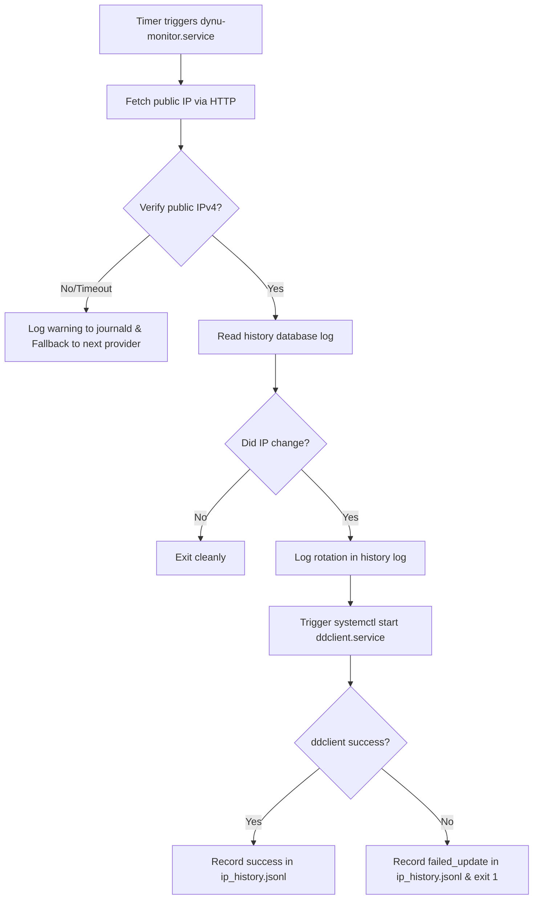

# 🌐 Dynu IP Monitor Service (dynu-ip-monitor)

This service manages the Dynamic DNS (DDNS) lifecycle for your host. Instead of continuously polling public APIs (which can lead to blocks or rate-limits), it implements a smart, local-first change detector that updates Dynu via `ddclient` **only when an actual WAN IP rotation is detected**.

---

## ⚙️ Architecture and Logic Flow

The synchronization process runs in the background as a system service completely decoupled from the graphical user session.



---

## 🔍 Public IP Discovery & Validation

### 1. HTTP Resolvers with Fallback
The script queries multiple independent IP reflection endpoints sequentially to handle offline states or service outages:
1. `https://api.ipify.org`
2. `https://ifconfig.me/ip`
3. `https://icanhazip.com`
4. `https://wtfismyip.com/text`

If a provider fails or times out, the script logs the warning to `stderr` and falls back to the next provider. If all providers fail, it exits with a non-zero code to flag a connectivity issue.

### 2. IP Address Validation
Every returned IP must pass a verification check to ensure it is a valid public IPv4 address. The check rejects:
* Loopback ranges (`127.0.0.0/8`)
* Private networks / RFC 1918 (`10.0.0.0/8`, `172.16.0.0/12`, `192.168.0.0/16`)
* Link-local addresses (`169.254.0.0/16`)
* Carrier-Grade NAT / CGNAT (`100.64.0.0/10`)

---

## 📊 Persistent History Registry

The monitor maintains a historical log of all your public IP assignments in a JSONLines format at `/var/lib/dynu/ip_history.jsonl`. 

Each entry records the timestamp, IP address, and status:
```json
{"timestamp": "2026-06-24T02:00:00Z", "ip": "186.116.231.181", "status": "success"}
{"timestamp": "2026-06-24T02:30:00Z", "ip": "186.116.231.181", "status": "success"}
{"timestamp": "2026-06-24T03:00:00Z", "ip": "186.116.232.40", "status": "success"}
```

At each check, the monitor compares the current public IP with the **last recorded successful IP** in the history file. If they match, the monitor exits cleanly without invoking the DNS provider APIs.

---

## 🔑 secrets-management & sops-nix Integration

### Dynamic User Credentials Access
The `ddclient` service in NixOS runs with systemd `DynamicUser=true` for security. Because the dynamic user doesn't exist statically, standard file ownership can prevent access.

We resolve this by using systemd **`LoadCredential`**:
1. `sops-nix` decrypts the credentials file owned by `root:root` into `/run/secrets/`.
2. The systemd service for `ddclient` is injected with:
   ```nix
   LoadCredential = [ "ddclient.conf:${config.sops.templates."ddclient.conf".path}" ];
   ```
3. Systemd copies the file securely, adjusts permissions, and exposes it inside the service boundaries at:
   `/run/credentials/ddclient.service/ddclient.conf`
4. `ddclient` reads the configuration from the credentials directory.

---

## ⏱️ Systemd Timers & Services Configuration

The updater is divided into two systemd units defined in [dynu.nix](file:///home/kiskaadee/Config/hosts/desktop/dynu.nix):

### 1. `dynu-monitor.timer`
Runs every 30 minutes. It triggers the `dynu-monitor.service` which executes the Python script.

### 2. `ddclient.service` (On-Demand)
The automatic `ddclient.timer` is disabled. The service is only triggered by the Python script using:
```bash
systemctl start ddclient.service
```
This ensures your host only makes outbound API calls to Dynu when a rotation actually occurs, maintaining zero overhead.
