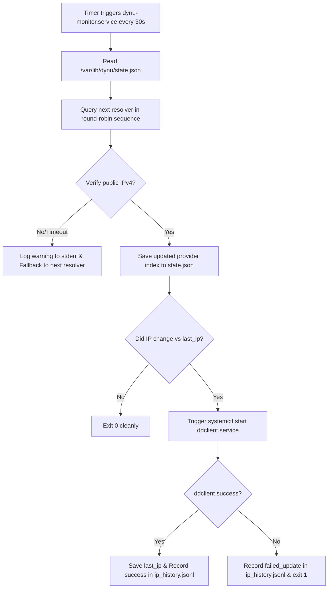

# 🌐 Dynu IP Monitor Service (dynu-ip-monitor)

This service manages the Dynamic DNS (DDNS) lifecycle for your host. Instead of continuously polling public APIs (which can lead to blocks or rate-limits), it implements a smart, local-first change detector that updates Dynu via `ddclient` **only when an actual WAN IP rotation is detected**.

---

## ⚙️ Architecture and Logic Flow

The synchronization process runs in the background as a system service completely decoupled from the graphical user session. It polls every **30 seconds** using a stateful round-robin resolver pool to minimize load per provider.


```mermaid
graph TD
    A[Timer triggers dynu-monitor.service every 30s] --> B[Read /var/lib/dynu/state.json]
    B --> C[Query next resolver in round-robin sequence]
    C --> D{Verify public IPv4?}
    D -- No/Timeout --> E[Log warning to stderr & Fallback to next resolver]
    D -- Yes --> F[Save updated provider index to state.json]
    F --> G{Did IP change vs last_ip?}
    G -- No --> H[Exit 0 cleanly]
    G -- Yes --> I[Trigger systemctl start ddclient.service]
    I --> J{ddclient success?}
    J -- Yes --> K[Save last_ip & Record success in ip_history.jsonl]
    J -- No --> L[Record failed_update in ip_history.jsonl & exit 1]
```

---

## 🔍 Public IP Discovery & Round-Robin Rotation

### 1. HTTP Resolvers with Stateful Round-Robin
The script maintains a pool of 5 independent IP reflection endpoints:
1. `https://api.ipify.org`
2. `https://icanhazip.com`
3. `https://ifconfig.me/ip`
4. `https://checkip.dynu.com`
5. `https://wtfismyip.com/text`

On each run (every 30 seconds), the monitor loads `/var/lib/dynu/state.json`, selects the next resolver in sequence (`(last_index + 1) % N`), and queries it. If that resolver fails or times out, it immediately cascades to subsequent resolvers in the circular pool until one succeeds.

With 5 providers queried at a 30-second interval, each provider is contacted at most **once every 2.5 minutes** (~24 requests/hour), far below free tier rate limits.

### 2. IP Address Validation & Extraction
Every returned response is parsed with regex extraction and checked to ensure it is a valid public IPv4 address. The check rejects:
* Loopback ranges (`127.0.0.0/8`)
* Private networks / RFC 1918 (`10.0.0.0/8`, `172.16.0.0/12`, `192.168.0.0/16`)
* Link-local addresses (`169.254.0.0/16`)
* Carrier-Grade NAT / CGNAT (`100.64.0.0/10`)

---

## 📊 Persistent History Registry & State

### 1. State File (`/var/lib/dynu/state.json`)
Stores the current round-robin cursor and the latest confirmed public IP:
```json
{
  "last_provider_index": 2,
  "last_ip": "186.168.137.93"
}
```

### 2. Transition History Log (`/var/lib/dynu/ip_history.jsonl`)
The monitor maintains a historical log of all public IP rotations in JSONLines format:
```json
{"timestamp": "2026-09-07T12:00:00.000000+00:00", "ip": "190.253.250.211", "status": "success", "details": "Provider: https://api.ipify.org"}
{"timestamp": "2026-09-07T12:37:33.000000+00:00", "ip": "186.168.137.93", "status": "success", "details": "Provider: https://icanhazip.com"}
```

---

## 🔑 Secrets Management & sops-nix Integration

### Dynamic User Credentials Access
The `ddclient` service in NixOS runs with systemd `DynamicUser=true` for security. Because the dynamic user doesn't exist statically, standard file ownership can prevent access.

We resolve this by using systemd **`LoadCredential`**:
1. `sops-nix` decrypts the credentials file owned by `root:root` into `/run/secrets/`.
2. The systemd service for `ddclient` is injected with:
   ```nix
   LoadCredential = [ "ddclient.conf:${config.sops.templates."ddclient.conf".path}" ];
   ```
3. Systemd copies the file securely, adjusts permissions, and exposes it inside the service boundaries at:
   `/run/credentials/ddclient.service/ddclient.conf`
4. `ddclient` reads the configuration from the credentials directory.

---

## ⏱️ Systemd Timers & Services Configuration

The updater is divided into two systemd units defined in [dynu.nix](file:///home/kiskaadee/Config/hosts/server/dynu.nix):

### 1. `dynu-monitor.timer`
Runs every 30 seconds. It triggers the `dynu-monitor.service` which executes the Python script.

### 2. `ddclient.service` (On-Demand)
The automatic `ddclient.timer` is disabled. The service is only triggered by the Python script using:
```bash
systemctl start ddclient.service
```
This ensures your host only makes outbound API calls to Dynu when a rotation actually occurs, maintaining zero unnecessary DNS API overhead.
