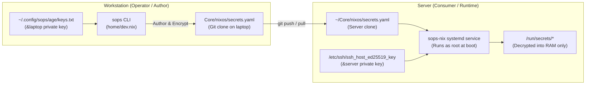

# 🔐 Secrets Management & Homelab GitOps Workflow

This document explains the secrets architecture for the workstation (`laptop`) and provides step-by-step operator workflows for managing homelab secrets in [`Core`](file:///home/kiskaadee/Projects/active/homelab/Core).

---

## 1. Secrets Architecture: Author vs. Consumer

A core architectural principle of this infrastructure is the separation between **Secret Authoring** and **Secret Consumption**:



### Roles & Boundaries
1. **Workstation (`Config`)**:
   - Holds **zero** declarative system secrets (`sops-nix` is not imported).
   - Provides operator CLI packages (`sops`, `age`, `rbw`) in `home/dev.nix`.
   - Stores the operator's personal age identity in `~/.config/sops/age/keys.txt`.
2. **Server (`Core`)**:
   - Headless consumer running Docker containers, databases, and Traefik.
   - Decrypts secrets at boot into a secure ramfs (`/run/secrets/`) using `/etc/ssh/ssh_host_ed25519_key`.
   - Unprivileged SSH sessions cannot edit secrets directly on the server.

---

## 2. Operator Workflow: Authoring & Rotating Secrets

To rotate or add a secret for homelab services:

### Step 1: Open Ciphertext Locally on Workstation
```bash
cd ~/Projects/active/homelab/Core/nixos
sops secrets.yaml
```

SOPS detects your personal identity in `~/.config/sops/age/keys.txt`, decrypts the file in memory, and opens your default editor (`$EDITOR` / Neovim).

### Step 2: Make Changes and Save
Edit values as necessary. Upon exiting the editor, SOPS encrypts new values using the public keys defined in `Core/.sops.yaml`.

### Step 3: Commit and Push
```bash
git add secrets.yaml
git commit -m "sec(core): rotate service credentials"
git push origin main
```

### Step 4: Rebuild Server
```bash
ssh server-remote "cd ~/Core && git pull && sudo nixos-rebuild switch --flake .#server"
```
The server evaluates the new ciphertext, decrypts it into `/run/secrets/`, and restarts affected systemd and Docker containers.

---

## 3. Backing Up & Restoring the Operator Age Key

The operator key is your cryptographic identity for managing homelab infrastructure:

```bash
# Location:
~/.config/sops/age/keys.txt

# File format:
# public key: age1...
AGE-SECRET-KEY-1...
```

Store this key securely in a password manager (e.g. Bitwarden/Vaultwarden). If re-installing the workstation, restore this file with mode `0600` before editing `Core` secrets.
