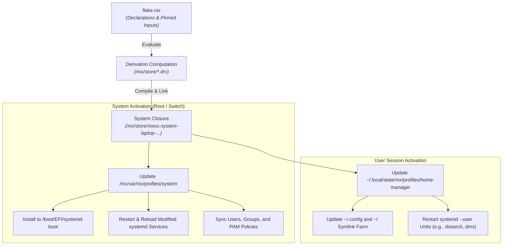

# 🔄 System Lifecycle: Rebuilding, Rollbacks & Maintenance

This document explains the technical lifecycle of the workstation—from Nix flake evaluation down to system activation—and provides operational procedures for rollbacks and disk maintenance.

---

## 1. What Happens During `nixos-rebuild switch`?

When you execute a system rebuild, NixOS and Home Manager execute a multi-stage pipeline:



---

## 2. The Command Matrix: Rebuild Actions

| Command | Rebuilds System? | Boots Next Time? | Affects Active Session? | Use Case |
| :--- | :--- | :--- | :--- | :--- |
| `nix build .#nixosConfigurations.laptop.config.system.build.toplevel --no-link` | Yes (Dry) | No | No | Safe validation of compilation without system mutation. |
| `sudo nixos-rebuild dry-build --flake .#laptop` | Yes (Dry) | No | No | Prints what would be built or downloaded. |
| `sudo nixos-rebuild test --flake .#laptop` | Yes (Live) | No | **Yes** | Test services or configs immediately without polluting bootloader. |
| `sudo nixos-rebuild switch --flake .#laptop` | Yes (Live) | **Yes** | **Yes** | Standard activation. Sets new default boot generation. |
| `sudo nixos-rebuild boot --flake .#laptop` | Yes (Live) | **Yes** | No | Prepares next boot without altering currently running services. |

---

## 3. Generations & Rollback Strategies

Every time `nixos-rebuild switch` runs, NixOS records a numbered generation.

### Strategy A: Bootloader Menu Rollback (Disaster Recovery)
If a new generation prevents the display server or network from starting:
1. Reboot the laptop.
2. At the `systemd-boot` menu, press `Space` or arrow keys.
3. Select an earlier generation from the list (e.g. `Generation 42`).
4. Boot into the known working system.

### Strategy B: Command-Line Rollback (Active Session)
If an update introduced a minor defect and you are logged in:
```bash
# Roll back system to the previous generation
sudo nixos-rebuild --rollback switch

# Roll back only Home Manager (user session)
home-manager generations
# Select generation ID to activate
```

### Strategy C: List Generations
```bash
# List system generations
sudo nix-env -p /nix/var/nix/profiles/system --list-generations
```

---

## 4. Workstation Maintenance Runbook

### Routine Disk Cleanup
Over time, old generations accumulate in `/nix/store`:

```bash
# 1. Delete system generations older than 14 days
sudo nix-collect-garbage --delete-older-than 14d

# 2. Delete user-level generations older than 14 days
nix-collect-garbage --delete-older-than 14d

# 3. Clean untracked bootloader entries
sudo nixos-rebuild boot --flake .#laptop
```

### Updating Flake Dependencies
```bash
# Update all inputs (including nixpkgs channel tarball)
nix flake update

# Verify build before committing flake.lock
nix build .#nixosConfigurations.laptop.config.system.build.toplevel --no-link
```
